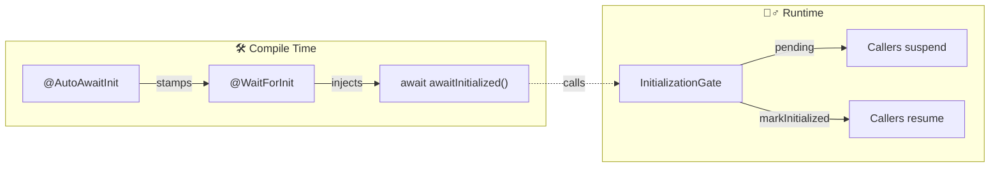
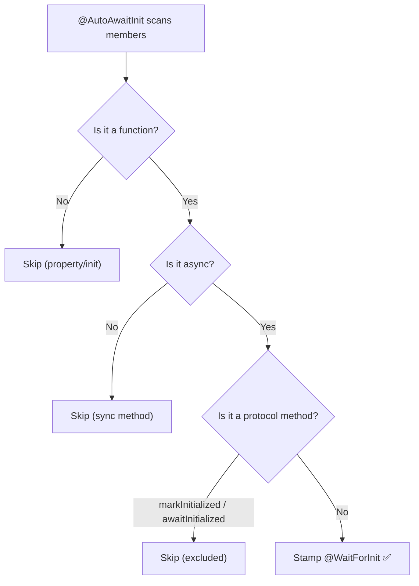
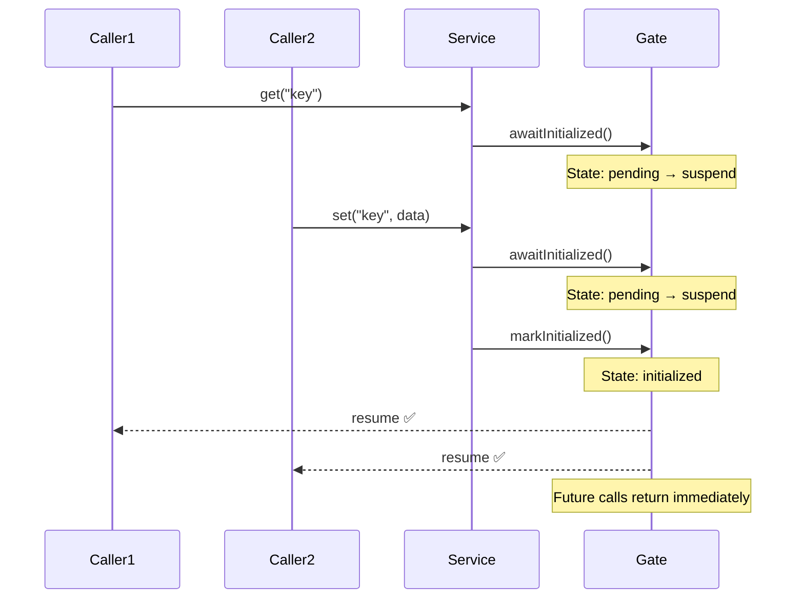
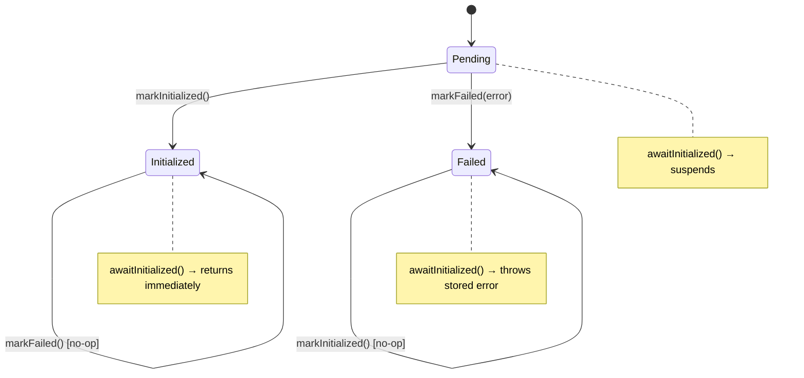
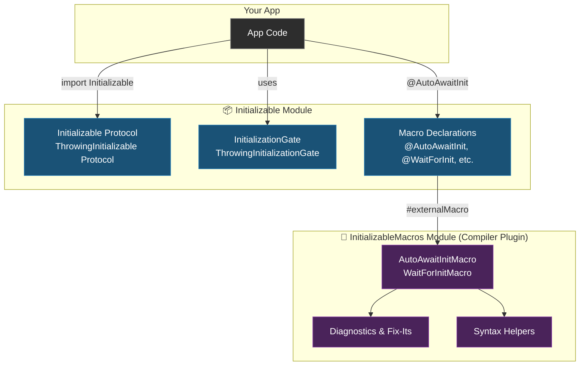

# ⚡ Initializable

**Zero-Boilerplate Async Initialization Gating for Swift Actors, Classes, and Structs**

[](#requirements)
[](#requirements)
[](#installation)
[](#license)

*Stop scattering `guard isReady` checks everywhere. Let the Swift compiler enforce initialization gates for you using the power of Macros.*

> [!NOTE]  
> **Initializable** guarantees that your type's async methods will automatically suspend until asynchronous setup is completely finished. No more runtime crashes due to uninitialized state. It works seamlessly with `actor`, `class`, and `struct`.

---

## 🛑 The Problem

Types like actors or classes often require asynchronous setup before they are ready to be used—connecting to a database, loading a configuration file, or authenticating with a remote server. 

Every method that depends on this setup must somehow **wait** until it's done.

### The Tedious Way (Without Initializable)

```swift
class DatabaseService {
    private var isReady = false

    func query(_ sql: String) async -> [Row] {
        // 😩 You have to remember this everywhere
        while !isReady { await Task.yield() }
        return try await db.execute(sql)
    }

    func insert(_ row: Row) async {
        // 😩 Miss one and you get a runtime crash
        while !isReady { await Task.yield() }
        db.insert(row)
    }
}
```

This is tedious, highly error-prone, and doesn't scale as your codebase grows.

## ✨ The Solution

**Initializable** gives you a single, elegant annotation on your type. Every async method automatically waits for initialization to complete!

### The Elegant Way (With Initializable)

```swift
@AutoAwaitInit
class DatabaseService: Initializable {
    let gate = InitializationGate()

    func setup() async {
        await connectToDatabase()
        
        // 🔓 Gate opens — all waiting methods proceed!
        await markInitialized()  
    }

    // ✅ Automatically waits for setup() — ZERO boilerplate needed!
    func query(_ sql: String) async -> [Row] { ... }
    func insert(_ row: Row) async { ... }
    func delete(_ id: Int) async { ... }
}
```

> [!TIP]  
> **Zero** runtime overhead after initialization. **Zero** boilerplate. **Zero** chance of forgetting a check.

---

## 📖 Table of Contents

- [Quick Start](#-quick-start)
- [Core Concepts](#-core-concepts)
- [Usage Guide](#-usage-guide)
  - [Non-Throwing Initialization](#1-non-throwing-initialization)
  - [Throwing Initialization (Failable)](#2-throwing-initialization-failable)
  - [Manual Per-Method Control](#3-manual-per-method-control)
- [Architecture](#-architecture)
  - [File Map](#file-map)
- [Macro Reference](#-macro-reference)
- [Diagnostics & Fix-Its](#-diagnostics--fix-its)
- [API Reference](#-api-reference)
- [Installation](#-installation)
- [Requirements](#-requirements)

---

## 🚀 Quick Start

### 1. Add the Package
In your `Package.swift`, add the dependency:
```swift
dependencies: [
    .package(url: "https://github.com/k-arindam/Initializable.git", from: "1.0.0")
]
```

### 2. Import & Conform
Import the module and annotate your type (can be `actor`, `class`, or `struct`):
```swift
import Initializable

@AutoAwaitInit
actor MyService: Initializable {
    let gate = InitializationGate()

    func setup() async {
        // ... perform your async setup ...
        await markInitialized()
    }

    func fetchData() async -> Data {
        // ✨ MAGIC: `await awaitInitialized()` is injected here by the macro
        return cachedData
    }
}
```

### 3. Use It
Simply call your methods. They will automatically wait if setup isn't finished!
```swift
let service = MyService()

// Kick off the setup (it will run concurrently)
Task { await service.setup() }

// This call will safely suspend until `setup()` completes!
let data = await service.fetchData()  
```

---

## 🧠 Core Concepts

At a high level, Initializable uses Swift Macros to inject gating logic at compile time, and an Actor-based state machine to manage continuations at runtime.



| Concept | Description |
|:---|:---|
| 📜 **Protocol** (`Initializable`) | Requires a `gate` property. Provides `markInitialized()`, `awaitInitialized()`, and `initialized`. |
| 🚧 **Gate** (`InitializationGate`) | Actor that safely holds continuations and resumes them when the gate opens. |
| 💉 **Body Macro** (`@WaitForInit`) | Injects `await awaitInitialized()` at the start of a single specific method. |
| 🏷️ **Member Macro** (`@AutoAwaitInit`) | Automatically stamps `@WaitForInit` on **all** async methods in the type. |

### Variants
There are **throwing variants** of each component for failable initialization (e.g. network requests that might fail):

| Component Type | Non-Throwing | Throwing (Failable) |
|:---|:---|:---|
| **Protocol** | `Initializable` | `ThrowingInitializable` |
| **Gate** | `InitializationGate` | `ThrowingInitializationGate` |
| **Body Macro** | `@WaitForInit` | `@WaitForThrowingInit` |
| **Member Macro**| `@AutoAwaitInit` | `@AutoAwaitThrowingInit` |

---

## 📚 Usage Guide

### 1. Non-Throwing Initialization
Use this when your setup **cannot fail** (e.g., loading a local cache, connecting to an in-memory store).

```swift
import Initializable

@AutoAwaitInit
class CacheService: Initializable {
    let gate = InitializationGate()
    private var store: [String: Data] = [:]

    func warmUp() async {
        store = await loadFromDisk()
        await markInitialized()
    }

    // ✅ Auto-gated — automatically waits for warmUp()
    func get(_ key: String) async -> Data? {
        return store[key]
    }

    // ❌ Sync — skipped by the macro (no gate needed)
    func cacheDirectory() -> URL {
        FileManager.default.temporaryDirectory
    }
}
```

### View Compile-Time Expansion Flow



### What Happens at Runtime



### 2. Throwing Initialization (Failable)
Use this when your setup **can fail** (e.g., network connections, database migrations, API authentication).

> [!IMPORTANT]  
> You must use `ThrowingInitializable`, `ThrowingInitializationGate`, and `@AutoAwaitThrowingInit`.

```swift
import Initializable

@AutoAwaitThrowingInit
struct DatabaseService: ThrowingInitializable {
    let gate = ThrowingInitializationGate()
    private var connection: DBConnection?

    mutating func connect(to url: URL) async {
        do {
            connection = try await DBConnection.open(url)
            await markInitialized()    // ✅ Success
        } catch {
            await markFailed(error)    // ❌ Propagate error to all waiting methods
        }
    }

    // ✅ Auto-gated — waits for connect, or throws if connect failed
    func query(_ sql: String) async throws -> [Row] {
        return try await connection!.execute(sql)
    }

    // ⚠️ WARNING: If a method is async but NOT throws, the macro will emit a compiler diagnostic with a fix-it!
    // func ping() async -> Bool { ... }
}
```

### View Throwing State Machine


> **State Stickiness**: The first call to `markInitialized()` or `markFailed(_:)` wins. Subsequent calls to either method are safe **no-ops**.

### 3. Manual Per-Method Control
If you prefer fine-grained control instead of the blanket `@AutoAwaitInit` macro, you can apply `@WaitForInit` to individual methods manually:

```swift
actor SelectiveService: Initializable {
    let gate = InitializationGate()

    func setup() async { await markInitialized() }

    @WaitForInit  // ← Only this method will wait
    func criticalOperation() async -> Result {
        return performWork()
    }

    // No macro — caller is entirely responsible for timing
    func bestEffortOperation() async -> Result? {
        return try? performWork()
    }
}
```

---

## 🏗 Architecture

Initializable is split into the runtime library and the compile-time macro plugin.



### File Map

```text
Sources/
├── Initializable/                         # Public API
│   ├── Enums.swift                        # InitializationState, GateType
│   ├── Gate.swift                         # InitializationGate, ThrowingInitializationGate
│   ├── Initializable.swift                # Initializable, ThrowingInitializable protocols
│   └── Macros.swift                       # @AutoAwaitInit, @WaitForInit declarations
│
└── InitializableMacros/                   # Compiler plugin (not shipped in binary)
    ├── InitializableMacros.swift           # @main plugin entry point
    ├── AutoAwaitInitMacro.swift            # Member-attribute macro implementations
    ├── WaitForInitMacro.swift              # Body macro implementations
    ├── Messages.swift                      # Diagnostic & fix-it messages
    ├── FunctionDeclSyntax+Extensions.swift # AST inspection helpers
    └── MemberAttributeMacro+Extensions.swift # Duplicate detection logic

Tests/
└── InitializableTests/
    ├── WaitForInitMacroTests.swift         # @WaitForInit body macro tests
    ├── WaitForThrowingInitMacroTests.swift  # @WaitForThrowingInit body macro tests
    ├── AutoAwaitInitMacroTests.swift        # @AutoAwaitInit member-attribute tests
    ├── AutoAwaitThrowingInitMacroTests.swift # @AutoAwaitThrowingInit tests
    └── RuntimeTests.swift                   # Gate & protocol runtime behavior tests
```

---

## 🔍 Macro Reference

### `@AutoAwaitInit` & `@AutoAwaitThrowingInit`
| Feature | Details |
|:---|:---|
| **Type** | `@attached(memberAttribute)` |
| **Target** | Actor / Class / Struct conforming to `Initializable` (or `ThrowingInitializable`) |
| **Effect** | Stamps `@WaitForInit` (or `@WaitForThrowingInit`) on every qualifying async method |
| **Excludes** | `markInitialized()`, `awaitInitialized()`, `markFailed()`, non-function members, sync methods |

### `@WaitForInit` & `@WaitForThrowingInit`
| Feature | Details |
|:---|:---|
| **Type** | `@attached(body)` |
| **Target** | Individual `async` (or `async throws`) function inside a conforming type |
| **Effect** | Prepends `await awaitInitialized()` (or `try await...`) to the function body |

---

## 🛠 Diagnostics & Fix-Its

Initializable provides rich compiler diagnostics with actionable fix-its. You'll never be left guessing what went wrong!

### `@WaitForInit` & `@WaitForThrowingInit`
| Scenario | Diagnostic Error Message | Xcode Fix-It Suggestion |
|:---|:---|:---|
| **Sync function** | `@WaitForInit requires the function to be 'async'` | Add `async` |
| **`throws`-only function** | `@WaitForThrowingInit requires the function to be 'async'` | Add `async` |
| **`async`-only function** | `@WaitForThrowingInit requires the function to be 'throws'` | Add `throws` |
| **Sync non-throwing** | `@WaitForThrowingInit requires the function to be 'async throws'` | Add `async throws` |
| **No conformance** | `@WaitForInit can only be used in a type that conforms to 'Initializable'` | *None* |
| **Free function** | `@WaitForInit can only be applied inside a type declaration` | *None* |

### `@AutoAwaitInit` & `@AutoAwaitThrowingInit`
| Scenario | Diagnostic Error Message | Xcode Fix-It Suggestion |
|:---|:---|:---|
| **No conformance** | `@AutoAwaitInit can only be applied to a type that conforms to 'Initializable'` | *None* |
| **Duplicate attribute** | `@WaitForInit should not be added manually when @AutoAwaitInit is applied...` | Remove `@WaitForInit` |

---

## 📖 API Reference

### Protocols

#### `Initializable`
```swift
public protocol Initializable {
    var gate: InitializationGate { get }
}
```
* `initialized`: Async boolean property. Returns `true` after `markInitialized()`.
* `markInitialized()`: Opens the gate. Safe to call multiple times (idempotent).
* `awaitInitialized()`: Suspends execution until the gate is opened.

#### `ThrowingInitializable`
```swift
public protocol ThrowingInitializable {
    var gate: ThrowingInitializationGate { get }
}
```
* `initialized`: Async boolean property. Returns `true` only on success.
* `markFailed<E: Error>(_ error: E)`: Fails the gate with the given error. Idempotent.
* `awaitInitialized() throws`: Suspends until resolved; throws if initialization failed.

### Gates

#### `InitializationGate`
* **Continuation type**: `CheckedContinuation<Void, Never>`
* **Cancellation**: Resumes normally (returns `Void`). Task cancellation will not throw.
* **Thread safety**: Actor-isolated — all state mutations are serial.

#### `ThrowingInitializationGate`
* **Continuation type**: `CheckedContinuation<Void, any Error>`
* **Cancellation**: Throws `CancellationError` automatically if the waiting task is cancelled.
* **State stickiness**: The first resolution (success or failure) permanently locks the state.

---

## 📦 Installation

### Swift Package Manager
Add the dependency to your `Package.swift`:
```swift
dependencies: [
    .package(url: "https://github.com/k-arindam/Initializable.git", from: "1.0.0")
],
targets: [
    .target(
        name: "YourTarget",
        dependencies: ["Initializable"]
    )
]
```

Or via Xcode: **File → Add Package Dependencies** → paste the repository URL.

---

## ⚙️ Requirements

| Platform/Tool | Minimum Version |
|:---|:---|
| **Swift** | 6.3 |
| **Xcode** | 16.3 |
| **iOS** | 15.0 |
| **macOS** | 12.0 |
| **tvOS** | 15.0 |
| **watchOS** | 9.0 |

> [!NOTE]  
> Swift macros generally require Swift 5.9+, but this package leverages advanced Swift 6.3 features including `@attached(body)` macros and `CheckedContinuation` isolation.

---

## 📄 License

This project is available under the MIT License. See the [LICENSE](LICENSE) file for details.

**Built with ❤️ using Swift Macros**
