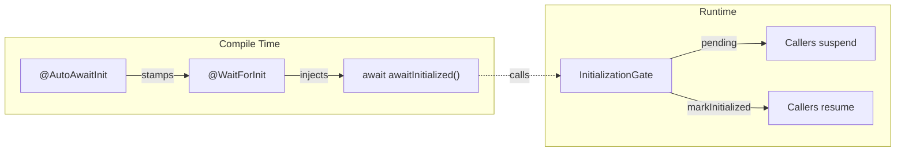
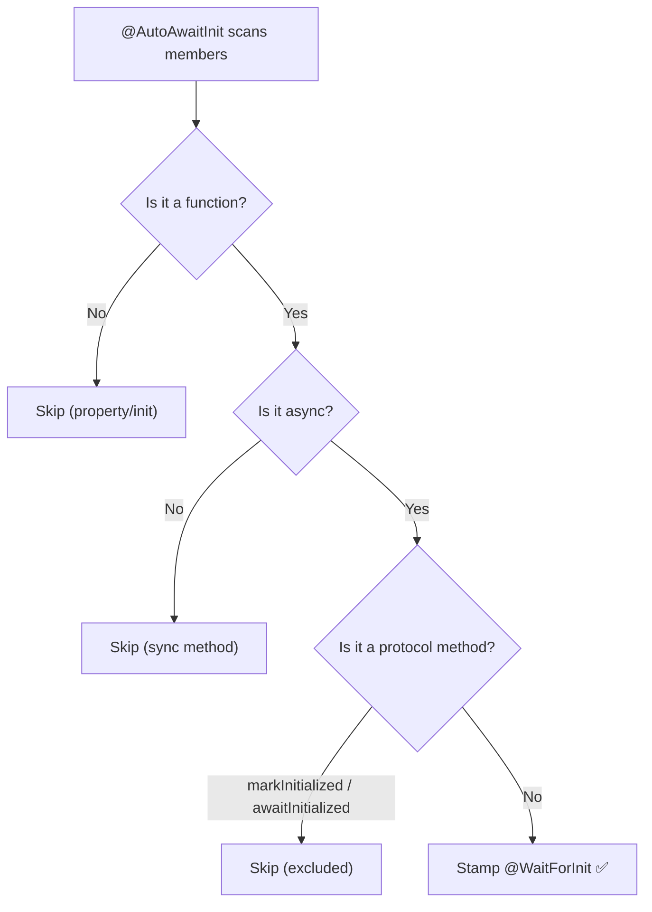
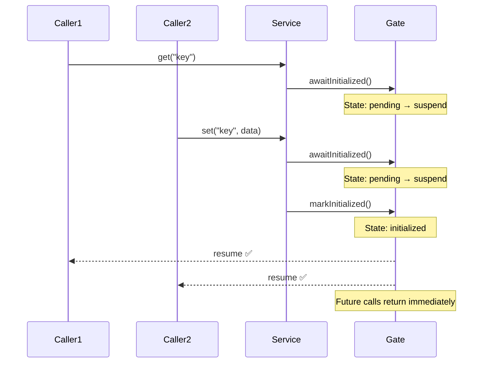
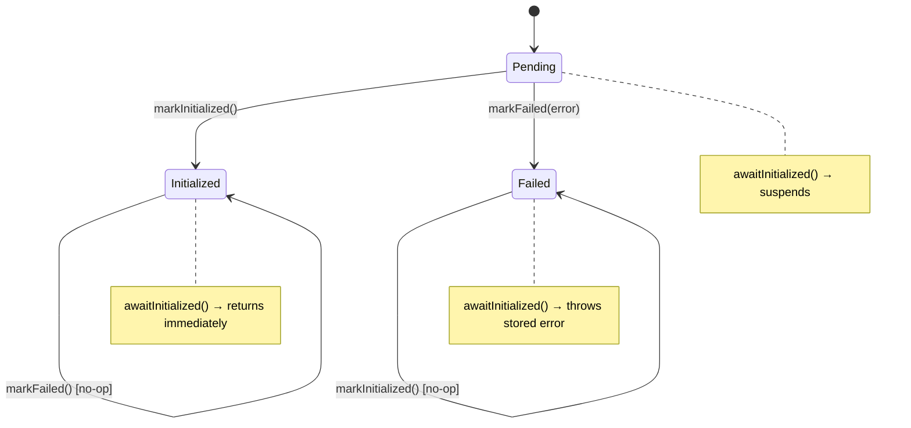

<!-- <](#requirements)
[](#requirements)
[](#installation)
[](#license)

*Stop scattering `guard isReady` checks everywhere.  
Let the compiler enforce initialization gates for you.*

<!-- </div> -->

---

## The Problem

Actors often need asynchronous setup — connecting to a database, loading a config file, authenticating with a server. Every method that depends on this setup must somehow **wait** until it's done:

```swift
actor DatabaseService {
    private var isReady = false

    func query(_ sql: String) async -> [Row] {
        // 😩 You have to remember this everywhere
        while !isReady { await Task.yield() }
        return try await db.execute(sql)
    }

    func insert(_ row: Row) async {
        // 😩 Miss one and you get a runtime crash
        while !isReady { await Task.yield() }
        db.insert(row)
    }
}
```

This is tedious, error-prone, and doesn't scale.

## The Solution

**Initializable** gives you a single annotation on the actor, and every async method automatically waits for initialization:

```swift
@AutoAwaitInit
actor DatabaseService: Initializable {
    let gate = InitializationGate()

    func setup() async {
        await connectToDatabase()
        await markInitialized()  // 🔓 Gate opens — all waiting methods proceed
    }

    // ✅ Automatically waits for setup() — no boilerplate needed
    func query(_ sql: String) async -> [Row] { ... }
    func insert(_ row: Row) async { ... }
    func delete(_ id: Int) async { ... }
}
```

Zero runtime overhead after initialization. Zero boilerplate. Zero chance of forgetting a check.

---

## Table of Contents

- [Quick Start](#quick-start)
- [Core Concepts](#core-concepts)
- [Usage Guide](#usage-guide)
  - [Non-Throwing Initialization](#non-throwing-initialization)
  - [Throwing Initialization (Failable)](#throwing-initialization-failable)
  - [Manual Per-Method Control](#manual-per-method-control)
- [Architecture](#architecture)
- [Macro Reference](#macro-reference)
- [Diagnostics & Fix-Its](#diagnostics--fix-its)
- [API Reference](#api-reference)
- [Installation](#installation)
- [Requirements](#requirements)
- [License](#license)

---

## Quick Start

### 1. Add the Package

```swift
// Package.swift
dependencies: [
    .package(url: "https://github.com/k-arindam/Initializable.git", from: "1.0.0")
]
```

### 2. Import & Conform

```swift
import Initializable

@AutoAwaitInit
actor MyService: Initializable {
    let gate = InitializationGate()

    func setup() async {
        // ... perform async initialization ...
        await markInitialized()
    }

    func fetchData() async -> Data {
        // ← `await awaitInitialized()` is injected here by the macro
        return cachedData
    }
}
```

### 3. Use It

```swift
let service = MyService()

// Can be called immediately — it will suspend until setup() completes
Task { await service.setup() }
let data = await service.fetchData()  // Waits automatically ✨
```

---

## Core Concepts



| Concept | What It Does |
|---------|-------------|
| **Protocol** (`Initializable`) | Requires a `gate` property; provides `markInitialized()`, `awaitInitialized()`, `initialized` |
| **Gate** (`InitializationGate`) | Actor that holds continuations and resumes them when the gate opens |
| **Body Macro** (`@WaitForInit`) | Injects `await awaitInitialized()` at the start of a single method |
| **Member Attribute Macro** (`@AutoAwaitInit`) | Stamps `@WaitForInit` on **all** async methods in the type |

There are **throwing variants** of each for failable initialization:

| Non-Throwing | Throwing (Failable) |
|-------------|-------------------|
| `Initializable` | `ThrowingInitializable` |
| `InitializationGate` | `ThrowingInitializationGate` |
| `@WaitForInit` | `@WaitForThrowingInit` |
| `@AutoAwaitInit` | `@AutoAwaitThrowingInit` |

---

## Usage Guide

### Non-Throwing Initialization

Use when your setup **cannot fail** (e.g., loading a local cache, connecting to an in-memory store):

```swift
import Initializable

@AutoAwaitInit
actor CacheService: Initializable {
    let gate = InitializationGate()
    private var store: [String: Data] = [:]

    func warmUp() async {
        store = await loadFromDisk()
        await markInitialized()
    }

    // ✅ Auto-gated — waits for warmUp()
    func get(_ key: String) async -> Data? {
        return store[key]
    }

    // ✅ Auto-gated
    func set(_ key: String, value: Data) async {
        store[key] = value
    }

    // ❌ Sync — skipped by the macro (no gate needed)
    func cacheDirectory() -> URL {
        FileManager.default.temporaryDirectory
    }
}
```

**What happens at compile time:**



**What happens at runtime:**



---

### Throwing Initialization (Failable)

Use when your setup **can fail** (e.g., network connections, database migrations):

```swift
import Initializable

@AutoAwaitThrowingInit
actor DatabaseService: ThrowingInitializable {
    let gate = ThrowingInitializationGate()
    private var connection: DBConnection?

    func connect(to url: URL) async {
        do {
            connection = try await DBConnection.open(url)
            await markInitialized()    // ✅ Success
        } catch {
            await markFailed(error)    // ❌ Propagate to all waiters
        }
    }

    // ✅ Auto-gated — waits or throws
    func query(_ sql: String) async throws -> [Row] {
        return try await connection!.execute(sql)
    }

    // ✅ Auto-gated
    func insert(_ row: Row) async throws {
        try await connection!.insert(row)
    }

    // ⚠️ async but not throws — macro emits diagnostic with fix-it
    // func ping() async -> Bool { ... }
}
```

**State machine for ThrowingInitializationGate:**



> **State Stickiness**: The first call to `markInitialized()` or `markFailed(_:)` wins. Subsequent calls to either method are **no-ops**. This prevents race conditions where both success and failure paths might execute.

---

### Manual Per-Method Control

If you prefer fine-grained control instead of the blanket `@AutoAwaitInit`, apply `@WaitForInit` to individual methods:

```swift
actor SelectiveService: Initializable {
    let gate = InitializationGate()

    func setup() async { await markInitialized() }

    @WaitForInit  // ← Only this method waits
    func criticalOperation() async -> Result {
        return performWork()
    }

    // No macro — caller is responsible for timing
    func bestEffortOperation() async -> Result? {
        return try? performWork()
    }
}
```

---

## Architecture

### Module Structure


### File Map

```
Sources/
├── Initializable/                         # Public API
│   ├── Enums.swift                        # InitializationState, GateType
│   ├── Gate.swift                         # InitializationGate, ThrowingInitializationGate
│   ├── Initializable.swift                # Initializable, ThrowingInitializable protocols
│   └── Macros.swift                       # @AutoAwaitInit, @WaitForInit declarations
│
└── InitializableMacros/                   # Compiler plugin (not shipped in binary)
    ├── InitializableMacros.swift           # @main plugin entry point
    ├── AutoAwaitInitMacro.swift            # Member-attribute macro implementations
    ├── WaitForInitMacro.swift              # Body macro implementations
    ├── Messages.swift                      # Diagnostic & fix-it messages
    ├── FunctionDeclSyntax+Extensions.swift # AST inspection helpers
    └── MemberAttributeMacro+Extensions.swift # Duplicate detection logic

Tests/
└── InitializableTests/
    ├── WaitForInitMacroTests.swift         # @WaitForInit body macro tests
    ├── WaitForThrowingInitMacroTests.swift  # @WaitForThrowingInit body macro tests
    ├── AutoAwaitInitMacroTests.swift        # @AutoAwaitInit member-attribute tests
    ├── AutoAwaitThrowingInitMacroTests.swift # @AutoAwaitThrowingInit tests
    └── RuntimeTests.swift                   # Gate & protocol runtime behavior tests
```

---

## Macro Reference

### `@AutoAwaitInit`

| Property | Value |
|----------|-------|
| **Type** | `@attached(memberAttribute)` |
| **Applied to** | Actor / Class / Struct conforming to `Initializable` |
| **Effect** | Stamps `@WaitForInit` on every `async` method |
| **Excludes** | `markInitialized()`, `awaitInitialized()`, non-function members, sync methods |

### `@AutoAwaitThrowingInit`

| Property | Value |
|----------|-------|
| **Type** | `@attached(memberAttribute)` |
| **Applied to** | Actor / Class / Struct conforming to `ThrowingInitializable` |
| **Effect** | Stamps `@WaitForThrowingInit` on every `async throws` method |
| **Excludes** | `markInitialized()`, `markFailed()`, `awaitInitialized()`, non-function members |
| **Warns** | `async`-only methods get a "not throwing" diagnostic with fix-it |

### `@WaitForInit`

| Property | Value |
|----------|-------|
| **Type** | `@attached(body)` |
| **Applied to** | Individual `async` function inside an `Initializable` type |
| **Effect** | Prepends `await awaitInitialized()` to the function body |
| **Injected code** | `await awaitInitialized()` |

### `@WaitForThrowingInit`

| Property | Value |
|----------|-------|
| **Type** | `@attached(body)` |
| **Applied to** | Individual `async throws` function inside a `ThrowingInitializable` type |
| **Effect** | Prepends `try await awaitInitialized()` to the function body |
| **Injected code** | `try await awaitInitialized()` |

---

## Diagnostics & Fix-Its

The macros provide rich compiler diagnostics with actionable fix-its. You'll never be left guessing what went wrong.

### `@WaitForInit` / `@WaitForThrowingInit` Diagnostics

| Scenario | Diagnostic Message | Fix-It |
|----------|-------------------|--------|
| Sync function | `@WaitForInit requires the function to be 'async'` | Add `async` |
| `throws` only | `@WaitForThrowingInit requires the function to be 'async'` | Add `async` |
| `async` only (throwing variant) | `@WaitForThrowingInit requires the function to be 'throws'` | Add `throws` |
| Sync non-throwing | `@WaitForThrowingInit requires the function to be 'async throws'` | Add `async throws` |
| No conformance | `@WaitForInit can only be used in a type that conforms to 'Initializable'` | — |
| Free function | `@WaitForInit can only be applied inside a type declaration` | — |

### `@AutoAwaitInit` / `@AutoAwaitThrowingInit` Diagnostics

| Scenario | Diagnostic Message | Fix-It |
|----------|-------------------|--------|
| No conformance | `@AutoAwaitInit can only be applied to a type that conforms to 'Initializable'` | — |
| Manual `@WaitForInit` | `@WaitForInit should not be added manually when @AutoAwaitInit is applied` | Remove `@WaitForInit` |
| `async` missing `throws` | `@WaitForThrowingInit requires the function to be 'throws'` | Add `throws` |

---

## API Reference

### Protocols

#### `Initializable`

```swift
public protocol Initializable {
    var gate: InitializationGate { get }
}
```

| Member | Signature | Description |
|--------|-----------|-------------|
| `gate` | `var gate: InitializationGate { get }` | The gate instance (provide as `let gate = InitializationGate()`) |
| `initialized` | `var initialized: Bool { get async }` | `true` after `markInitialized()` |
| `markInitialized()` | `func markInitialized() async` | Opens the gate; idempotent |
| `awaitInitialized()` | `func awaitInitialized() async` | Suspends until gate opens |

#### `ThrowingInitializable`

```swift
public protocol ThrowingInitializable {
    var gate: ThrowingInitializationGate { get }
}
```

| Member | Signature | Description |
|--------|-----------|-------------|
| `gate` | `var gate: ThrowingInitializationGate { get }` | The throwing gate instance |
| `initialized` | `var initialized: Bool { get async }` | `true` only after `markInitialized()`, `false` after `markFailed()` |
| `markInitialized()` | `func markInitialized() async` | Opens the gate; idempotent; no-op if already failed |
| `markFailed(_:)` | `func markFailed<E: Error>(_ error: E) async` | Fails the gate with the given error; idempotent |
| `awaitInitialized()` | `func awaitInitialized() async throws` | Suspends until resolved; throws on failure |

### Gates

#### `InitializationGate`

```swift
public actor InitializationGate {
    public init()
}
```

- **Continuation type**: `CheckedContinuation<Void, Never>`
- **Cancellation**: Resumes normally (returns `Void`)
- **Thread safety**: Actor-isolated — all state is serial

#### `ThrowingInitializationGate`

```swift
public actor ThrowingInitializationGate {
    public init()
}
```

- **Continuation type**: `CheckedContinuation<Void, any Error>`
- **Cancellation**: Throws `CancellationError`
- **Failure**: Throws the error passed to `markFailed(_:)`
- **State stickiness**: First resolution wins

---

## Installation

### Swift Package Manager

Add to your `Package.swift`:

```swift
dependencies: [
    .package(url: "https://github.com/k-arindam/Initializable.git", from: "1.0.0")
],
targets: [
    .target(
        name: "YourTarget",
        dependencies: ["Initializable"]
    )
]
```

Or in Xcode: **File → Add Package Dependencies** → paste the repository URL.

---

## Requirements

| Requirement | Minimum |
|------------|---------|
| Swift | 6.3 |
| Xcode | 16.3 |
| iOS | 15.0 |
| macOS | 12.0 |
| tvOS | 15.0 |
| watchOS | 9.0 |
| Mac Catalyst | 15.0 |

> **Note**: Swift macros require Swift 5.9+, but this package uses Swift 6.3 features including `@attached(body)` macros and `CheckedContinuation` with `isolation:`.

---

## License

This project is available under the MIT License. See the [LICENSE](LICENSE) file for details.

---

**Built with ❤️ using Swift Macros**
